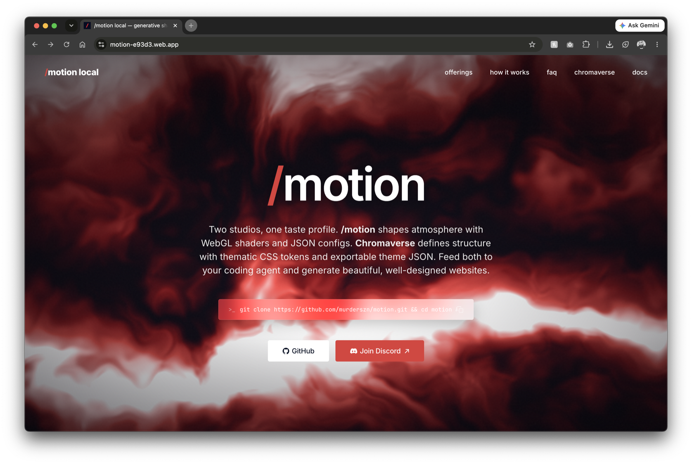
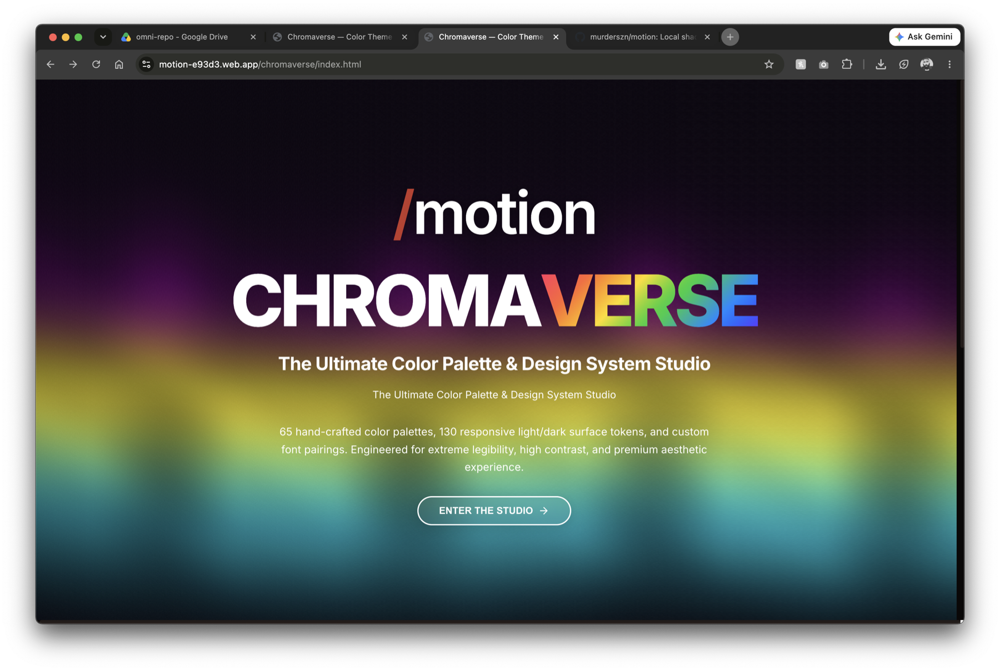

# /motion — generative shader studio + chromaverse design system

A browser-based **generative graphics studio** for creating seamless-loop motion
graphics with WebGL shaders, plus **Chromaverse** — a 65+ theme design-system
gallery. Built with TypeScript + Vite.

**[Live Demo →](https://motion-e93d3.web.app)**

---

## ✨ Features

- **23 shader presets** — aurora, flow, marble, plasma, glass, truchet,
  kaleidoscope, rorschach, and more
- **Seamless loops** — every animation loops perfectly (phase-driven, not
  time-driven)
- **Seed-based determinism** — same seed + preset = same result, always
- **Export** — PNG, WebM video, GIF, and self-contained HTML splash pages
- **65+ Chromaverse themes** — complete color systems with light/dark modes,
  font pairings, and design tokens
- **Text tool** — place, drag, style text with effects (neon glow, frosted
  glass, drop shadow, outline)
- **Live shader editor** — edit GLSL in real-time with error highlighting
- **13 UI themes** — dark, synthwave, dracula, arctic frost, and more
- **Shareable URLs** — encode your entire studio state in a link
- **Terminal panel** — built-in PTY shell via WebSocket

---

## Quick Start

```sh
git clone https://github.com/murderszn/motion.git
cd motion
npm install
npm run dev          # → http://localhost:5173
```

Open `studio.html` in browser for the shader studio, `index.html` for the
splash page.

### Optional servers

```sh
npm run server       # PTY terminal backend (WebSocket on port 3000)
npm run api          # Workshop signup API (requires MONGO_URI in .env)
```

> Run each server in its own terminal. See [.env.example](.env.example) for
> configuration.

**Browser:** Chrome / Edge recommended. Safari has limited WebM support — PNG
and GIF export work everywhere.

---

## Chromaverse



**Chromaverse** is /motion's companion **design-system studio** — 65+ hand-crafted
color palettes, each a complete identity with light + dark modes, matched surface
tokens, and custom font pairings.

**[Browse themes →](https://motion-e93d3.web.app/chromaverse/index.html)**

### What's included

- **65+ named palettes** — `vaporwave`, `kyoto-moss`, `bordeaux`, `cyberpunk`,
  `nordic`, `terracotta`, `sakura`, and many more
- **Light + dark modes** per theme (~130 total surface sets)
- **Shared token contract** — 4px spacing scale, radii, shadows, easing
- **Self-contained HTML** — each theme is a standalone file, deploy anywhere
- **Generator scripts** — `gen_themes.py` rebuilds all themes from a template

### Composing motion + surface + glass

| Layer | Source | Role |
|-------|--------|------|
| Motion | shader presets | Animated WebGL background |
| Surface | Chromaverse tokens | Colors, type, spacing, radii |
| Glass | glassmorphism / CSS | Frosted panels bridging layers |

---

## Project Structure

```
src/
├── index.ts                      # Splash page script
└── studio/
    ├── types.ts                  # Shared interfaces
    ├── state.ts                  # Constants (presets, palettes, sliders, themes)
    ├── webgl.ts                  # WebGL context, GLSL shader, draw(), hot-swap
    ├── render.ts                 # RAF loop, phase tracking, FPS
    └── ui/
        ├── main.ts               # Bootstrap
        ├── presets.ts            # Preset button grid
        ├── seed.ts               # Seed input + dice
        ├── palette.ts            # Color swatches + randomizer
        ├── sliders.ts            # Dynamic slider controls
        ├── sizes.ts              # Canvas size buttons
        ├── text.ts               # Text tool (click-to-place, drag, effects)
        ├── export.ts             # PNG / WebM / GIF export
        ├── export_embed.ts       # Self-contained HTML exporter
        ├── url_api.ts            # URL params, shareable link, JSON clipboard
        ├── terminal.ts           # xterm.js + WebSocket PTY
        ├── sidebar.ts            # Panel toggles, theme switcher
        ├── statusbar.ts          # FPS + status bar
        ├── shader_editor.ts      # Live GLSL editor + problems panel
        ├── command_palette.ts    # VS Code-style command palette
        └── keyboard.ts           # Keyboard shortcuts

chromaverse/
├── index.html                    # Theme gallery
├── gen_themes.py                 # Theme generator
├── theme_template.html           # Template for generation
└── *.html                        # 65+ individual theme pages

server/
├── server.mjs                    # Node.js PTY + WebSocket server
└── api.mjs                       # Express + MongoDB signup API

examples/                          # Standalone example pages
docs/                              # Design language, changelog, research
```

---

## How to Use the Studio

1. **Pick a preset** — 23 generative shader modes
2. **Set a seed** — 4-digit number for deterministic output (⚄ for random)
3. **Choose colors** — 4-stop gradient, 11 curated palettes, or custom
4. **Tune sliders** — speed, scale, density, distortion, detail, grain
5. **Pick canvas size** — 1:1, 16:9, 9:16, 4:5
6. **Set loop duration** — 2–10 seconds of seamless animation
7. **Add text** — press `T`, click to place, drag to move, style with effects
8. **Export** — PNG / WebM / GIF / self-contained HTML

### Keyboard Shortcuts

| Key | Action |
|-----|--------|
| `Space` | Pause / play |
| `R` | Randomize |
| `S` | Save PNG |
| `T` | Text tool |
| `F` | Fullscreen |
| `Escape` | Deactivate text tool |
| `Cmd+Shift+P` / `F1` | Command palette |
| `` Ctrl+` `` | Toggle terminal |
| `Cmd+B` | Toggle panel |

---

## Shader Presets

| Preset | Description |
|--------|-------------|
| `aurora` | Wavy glowing curtains of light |
| `contour waves` | Glowing isoline patterns from noise |
| `curl noise` | Divergence-free swirling fluid motion |
| `electric` | Branching, flickering lightning filaments |
| `flow` | Domain-warped liquid noise gradients |
| `glass` | Drifting frosted panes refracting color |
| `grain` | Soft grainy gradient washes |
| `halftone` | Animated dot-grid over a flow field |
| `kaleidoscope` | Mirrored radial symmetry slices |
| `lines` | Rotated parallel bands with wave distortion |
| `marble` | Domain-warped sine wave with fBM veining |
| `orbs` | Soft metaballs drifting on orbits |
| `plasma` | Classic multi-frequency sine wave plasma |
| `reeded` | Vertical reeded-glass rods refracting blobs |
| `ridged` | Sharp mountain ridges from inverted noise |
| `rings` | Concentric glowing rings modulated by noise |
| `rorschach` | Bilateral inkblot symmetry |
| `sd rosette` | Signed-distance petal symmetry with edge glow |
| `triangle lattice` | Rotating hexagonal triangle grid |
| `truchet` | Tile arc maze with hash-based orientation |
| `turbulence` | Flame-like fBM patterns |
| `waves` | Flowing contour bands |

---

## Architecture Notes

### The Seamless-Loop Invariant

Animation is driven by `u_phase ∈ [0, 2π)`, not raw time. Every animated term
must return to its starting state when `u_phase` wraps:

- Periodic terms use **integer multiples** of `u_phase`
  (`sin(x + 2.0*u_phase)` ✓ · `sin(x + 1.5*u_phase)` ✗)
- Noise fields drift along a **circular path** via `loopOff()`
  instead of a linear offset

### WebGL

WebGL 1.0 context with `preserveDrawingBuffer: true` (required for export).
One fullscreen triangle strip, one fragment shader with all presets branched on
`u_mode`. GLSL ES 1.0 constraints: constant loop bounds, explicit float types,
precision declarations required.

### Adding Things

| What | Where |
|------|-------|
| Preset | `PRESETS` in `state.ts` + `else if` in `webgl.ts` |
| Palette | `PALETTES` array in `state.ts` |
| Slider | `SLIDERS` in `state.ts` + `u_<id>` uniform in `webgl.ts` |
| Canvas size | `SIZES` in `state.ts` |
| Theme | `THEMES` in `state.ts` |

---

## Contributing

1. Fork the repo
2. Create a feature branch (`git checkout -b feature/my-preset`)
3. Follow the seamless-loop invariant for any shader changes
4. Respect WebGL 1.0 / GLSL ES 1.0 syntax constraints
5. Submit a pull request

---

## License

[MIT](LICENSE) © murderszn

---

## Credits

Inspired by [Inigo Quilez](https://iquilezles.org/), [The Book of Shaders](https://thebookofshaders.com/),
Casey Reas / Processing Foundation, Tyler Hobbs, Matt DesLauriers,
Dave Whyte (bees & bombs), Ryoji Ikeda / teamLab, FIELD.IO, and Universal Everything.

**Community:** [Join the Discord](https://discord.gg/F9Vy9ByYbB)
